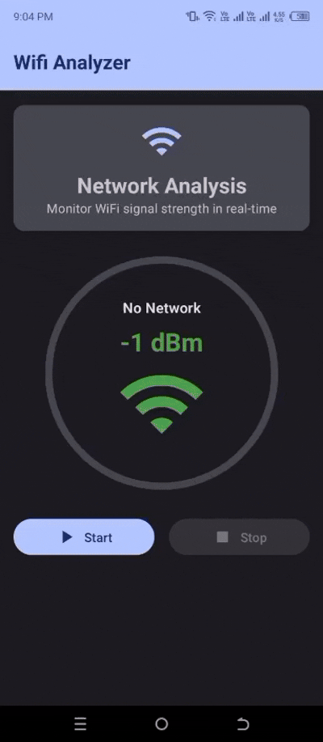

# WiFi Analyzer

A modern Android application built with Jetpack Compose that provides real-time WiFi signal strength analysis, interactive graphs, and comprehensive network statistics.

## 📱 Demo

  

## Features

- **Real-time Signal Monitoring**: Track WiFi signal strength in real-time with dBm readings
- **Interactive Signal Graph**: Visual representation of signal strength over time
- **Comprehensive Statistics**: Average, min, max, median, standard deviation, and ping measurements
- **Material Design 3**: Modern and intuitive user interface with dynamic theming
- **Network Detection**: Automatically detects and displays current connected network
- **Signal Quality Indicator**: Color-coded signal strength visualization
- **Ping Monitoring**: Measures network latency to assess connection quality

## Built With

- **Jetpack Compose** - Modern Android UI toolkit
- **Material Design 3** - Latest Material Design system
- **Kotlin Coroutines** - Asynchronous programming
- **Canvas API** - Custom graph drawing and visualizations
- **WifiManager** - Android WiFi system integration
- **MVVM Architecture** - Clean architecture pattern

## How It Works

1. Grant location and WiFi permissions to the app
2. Tap "Start" to begin real-time signal analysis
3. View live signal strength readings and network information
4. Monitor signal quality through color-coded indicators
5. Analyze historical data through interactive graphs
6. Review detailed statistics for network performance insights

### Required Permissions
- `ACCESS_WIFI_STATE` - Read WiFi network information
- `CHANGE_WIFI_STATE` - Trigger WiFi scans
- `ACCESS_FINE_LOCATION` - Access detailed network information
- `ACCESS_COARSE_LOCATION` - Basic location for network scanning

## Technical Details

### Signal Strength Ranges
- **-30 to -50 dBm**: Excellent signal (Green)
- **-50 to -60 dBm**: Good signal (Light Green)  
- **-60 to -70 dBm**: Fair signal (Amber)
- **-70 to -80 dBm**: Poor signal (Orange)
- **Below -80 dBm**: Very poor signal (Red)

## Key Components

- **SignalStrengthIndicator**: Circular indicator showing current signal strength
- **SignalGraph**: Real-time graph plotting signal strength over time
- **SignalStatistics**: Comprehensive statistics panel with multiple metrics
- **WifiScanReceiver**: BroadcastReceiver for handling WiFi scan results

## Usage Tips

- Ensure WiFi is enabled on your device before starting analysis
- Grant all required permissions for accurate readings
- Move around your location to see signal strength variations
- Use the statistics to identify optimal WiFi placement areas
- Monitor ping values to assess overall connection quality

## Limitations

- Requires Android device with WiFi capabilities
- Location permissions needed for detailed network information
- Signal readings depend on device hardware capabilities
- Ping measurements require active internet connection
